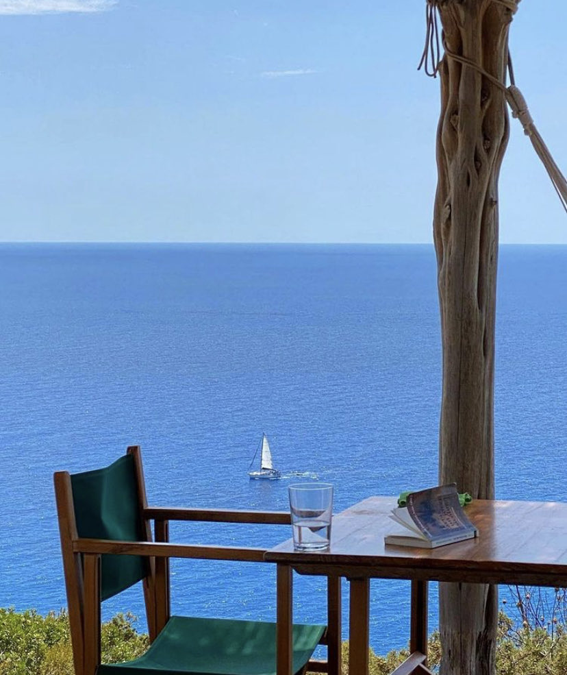

# Finn Reid
> "As he made no compromise with Time, Time kept out of his way, and only sighed at a distance because he could not overcome him." - Thoreau in Walden




I am a cognitive science student at UC San Diego interested in human computer interaction. Click [here](https://stayingqold.github.io/projects/) to see some projects I've worked on and [here](https://www.linkedin.com/in/finnreid/) for my linkedin. I also for UCSD's club lacrosse team ([here's a video](goal.MP4))

# Table of Contents
1. [Code Snippet](#code-cnippet)
2. [Favorite Books](#favorite-books)
3. [Bucket List](#bucket-list)


## Code Snippet
My favorite code snippet is [this one](https://www.a1k0n.net/2011/07/20/donut-math.html), which creates a spinning donut in your command line, and also is formatted to look like a donut. [This video from Lex Fridman](https://www.youtube.com/watch?v=DEqXNfs_HhY) explains it in more detail.
```
             k;double sin()
         ,cos();main(){float A=
       0,B=0,i,j,z[1760];char b[
     1760];printf("\x1b[2J");for(;;
  ){memset(b,32,1760);memset(z,0,7040)
  ;for(j=0;6.28>j;j+=0.07)for(i=0;6.28
 >i;i+=0.02){float c=sin(i),d=cos(j),e=
 sin(A),f=sin(j),g=cos(A),h=d+2,D=1/(c*
 h*e+f*g+5),l=cos      (i),m=cos(B),n=s\
in(B),t=c*h*g-f*        e;int x=40+30*D*
(l*h*m-t*n),y=            12+15*D*(l*h*n
+t*m),o=x+80*y,          N=8*((f*e-c*d*g
 )*m-c*d*e-f*g-l        *d*n);if(22>y&&
 y>0&&x>0&&80>x&&D>z[o]){z[o]=D;;;b[o]=
 ".,-~:;=!*#$@"[N>0?N:0];}}/*#****!!-*/
  printf("\x1b[H");for(k=0;1761>k;k++)
   putchar(k%80?b[k]:10);A+=0.04;B+=
     0.02;}}/*****####*******!!=;:~
       ~::==!!!**********!!!==::-
         .,~~;;;========;;;:~-.
             ..,--------,*/
```

## Favorite Books
* __Walden__ by *Henry David Thoreau*
* __Incerto__ by *Nassim Nicholas Taleb*
* __The Autobiography of Benjamin Franklin__
* __Benjamin Franklin__ by _Walter Isaacson_
* __Leonardo Da Vinci__ by _Walter Isaacson_
* __The Dream Machine__ by _M. Mitchell Waldrop_
* __Vagabonding__ by _Rolf Potts_

## Goals for this quarter
- [ ] Learn about the software development lifecycle.
- [ ] Meet more people in CS. 
- [ ] Build a cool project.

